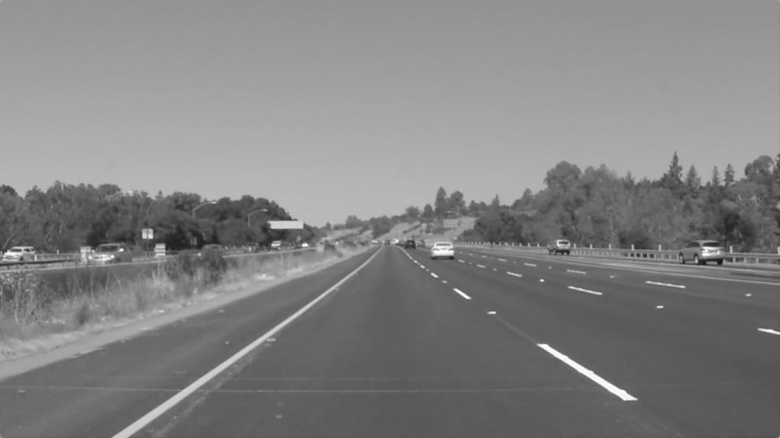

# Finding Lane Lines on the Road

The goals / steps of this project are the following:

* Make a pipeline that finds lane lines on the road from an image or video as source.
* Reflect on your work in a written report

This work has been created with the help of the Docker image and setup described in the [Configure and Manage Your Environment with Docker](https://github.com/udacity/CarND-Term1-Starter-Kit/blob/master/doc/configure_via_docker.md) document. When installed, running `make run` from the repo root directory will start the Docker container and show the results at the url found from the cli output. Please read the original [assignment instructions](./ASSIGNMENT.md) for more context.

## Pipeline

### 1. Grayscale

The first step after loading an image is to convert it to grayscale. We could load the image directly as grayscale however, as we need to blend the results into the original image we'd like it to be available too.



### 2. Gaussian Blur

Bluring will smooth out sudden sporadic changes in intensity and will make the following edge detection work with less noise in which we're not interested. What it does is applying a transformation kernel (matrix) to each pixel of the image.


### 3. Canny Edge detection

With the canny edge detection we start our collection of data of interest  with which we can detect lines in the future.


### 4. Select ROI

Applying the Canny edge detection will usually return more edges than we need to process, thus we focus our attention to an region of interest demarked by vertices which route from the bottom left, bottom right and the approximate center of where the line marking converge on the horizon. If the bottom demarking is too close/narrow then small horizontal movements would lose track of the markers thus its better to choose the whole width at the bottom of the ROI.


### 5. Hough Transform

With the help of cv2 `HoughLinesP`, we try to detect straight lines from the edges found in the ROI.
The function is dependend on finding a couple of parameters values that worked well with the testing images and first two videos.

```python
rho = 1            # distance resolution in pixels of the Hough grid
theta = np.pi/180  # angular resolution in radians of the Hough grid
threshold = 15     # minimum number of votes
min_line_len = 15  # minimum number of pixels to concider as line
max_line_gap = 1   # maximum pixel space between connectable line segments.
```


### 6. Extrapolation

From the data obtained in the Hough transformations step, we need to filter the lines of interest and average/extrapolate them in order to mark the driving lane boundaries at each side of the vehicle.

The lines found by applying the cv2 `HoughLinesP` filter are first sorted by their slope in the `separate_lines` function: a line with a positive slope belongs to the the lane marking on the right side of the vehicle, lines with negative slopes are at the left side. This seems counterintuitive at first until it is realized that the y-axis is mirrored over the x-axis while working with images.

Then all line centers and their slopes are calculated and averaged in `extrapolate_lines` and the once we obtained an average center and slope a line is extrapolated in the `extrapolate_line` helper where we find the y intercept of the averaged line. Then the y intercept is used to find the x at maximum and minimum required height (y).


### 6. Blending

The last step in the pipeline combines the extrapolated lines with the original image with the use of the
cv2 `addWeighted` function. It will blend both images based on the weight and gamma given to either input.
Once the algorithm is working as expected and detects the lines correctly we might not need this step/information, it is however a great way to showcase the result.


## Shorcomings

* Changing lanes will lead to loosing track of markers
* Changing heading will lead to loosing track of markers
* Road surface changes have negative impact on detection pipeline
* Lighting conditions have negative impact on detection pipeline
* When other vehicles block the lines we'll either lose the information
* Truck trailer edges being detected as a road marker

---

* Optional Challenge crashes near the grey road surface and sudden detections of cracks around 3-4 seconds into the video.

## Improvements

In order to deal with sudden road surface and lighting conditions related issues we could keep track
of a running average that we could plug in whenever there is some data loss in our pipeline. This cannot be done continuously. Might also be possible to try normalize the light intensity.
Earlier in the course it was mentioned that these systems have data related to the road surface and have access to gps, it might be possible to dynamically adapt the pipeline parameters based on this information.

## Sources

* [Hough transform](https://en.wikipedia.org/wiki/Hough_transform)
* [Linear equation](https://en.wikipedia.org/wiki/Linear_equation)
* [Canny edge detector](https://en.wikipedia.org/wiki/Canny_edge_detector)
* [Gaussian blur](https://en.wikipedia.org/wiki/Gaussian_blur)
* [Udacity, Introduction to computer vision (free)](https://www.udacity.com/course/introduction-to-computer-vision--ud810)

## Further exploration

* [How Hough Transform works](https://www.youtube.com/watch?v=4zHbI-fFIlI)
* [Hough Line Transform](https://docs.opencv.org/3.4.0/d9/db0/tutorial_hough_lines.html)
* [Robust Extrapolation of Lines in Video Using Probabilistic Hough Transform](https://medium.com/@esmat.anis/robust-extrapolation-of-lines-in-video-using-linear-hough-transform-edd39d642ddf)
* [RANSAC Tutorial](http://www.math-info.univ-paris5.fr/~lomn/Cours/CV/SeqVideo/Material/RANSAC-tutorial.pdf)
* [RANSAC for dummies](http://www.math-info.univ-paris5.fr/~lomn/Cours/CV/SeqVideo/Material/RANSAC-tutorial.pdf)
